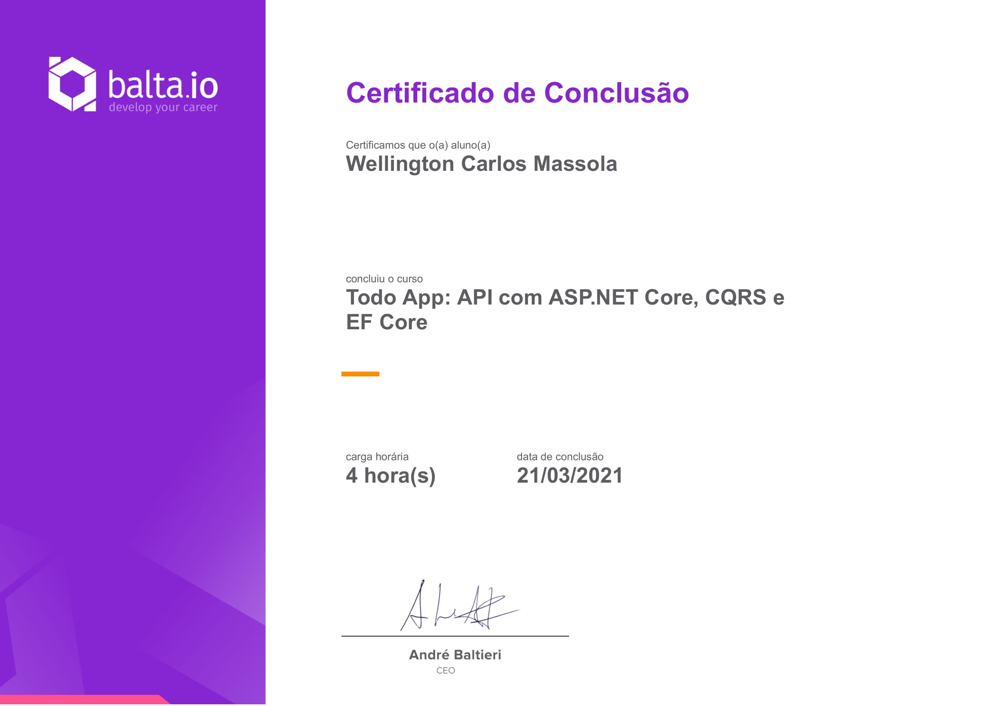

# Curso [balta.io 7196](https://balta.io/cursos/todo-app-api-com-aspnet-core-cqrs-e-ef-core)

Curso Backend C#.  

Link do curso: [https://balta.io/cursos/todo-app-api-com-aspnet-core-cqrs-e-ef-core](https://balta.io/cursos/todo-app-api-com-aspnet-core-cqrs-e-ef-core)

Tecnologias:  
 

## Todo App: API com ASP<spam>.</spam>NET Core, CQRS e EF Core

Quer aprender a criar uma API completa para seu App Web ou Mobile? Então este curso é para você!

## Instrutor

André Baltieri - 8x Microsoft MVP

## Progresso do curso

- [x] Setup
- [x] Overview da API
- [x] Criando a Estrutura do Projeto
- [x] Entidade Base
- [x] Entidade TodoItem
- [x] Commands
- [x] Definindo o Contrato dos Comandos
- [x] Estrutura dos Commands
- [x] Domínios e Exceptions
- [x] Exceptions Vs Domain Notifications
- [x] Design By Contracts
- [x] Command Result
- [x] Marcar Tarefa como Concluida
- [x] Marcar Tarefa como Incompleta
- [x] Update Todo Command
- [x] Porque utilizar Handlers?
- [x] Contrato de Handler
- [x] Repository Pattern
- [x] Contrato do Todo Repository
- [x] Comaçando o Handler
- [x] Fail Fast Validations
- [x] Finalizando a criação de uma Tarefa
- [x] Testes de Unidade
- [x] Testando o Comando
- [x] Refatorando os Testes
- [x] Iniciando os testes dos handlers
- [x] Fake Repositories
- [x] Testando o Handler
- [x] Testando a Entidade
- [x] Manipulando a atualização da tarefa
- [x] Finalizando o Handler
- [x] Entity Framework Core
- [x] Data Context
- [x] Alterando os Mapeamentos
- [x] Queries
- [x] Todo Queries
- [x] Testando as Queries
- [x] Resolvendo Dependências
- [x] Utilizando Banco de Dados em Memória
- [x] Gerenciando as Dependências
- [x] Estrutura do Repositório
- [x] Criando e Atualizando uma Tarefa
- [x] Executando uma Query
- [x] Finalizando o Repositório
- [x] Ajustes na API e EF
- [x] Criando uma Tarefa
- [x] Testando a API
- [x] Finalizando o Controller
- [x] Testando o Controller
- [x] Configurando o SQL Server
- [x] Executando as Migrações
- [x] Configurando o Firebase
- [x] Adicionando autenticação pelo Google
- [x] Obtendo Token do Google
- [x] Restringindo acesso nos Controllers
- [x] Testando a API
- [x] Finalização

